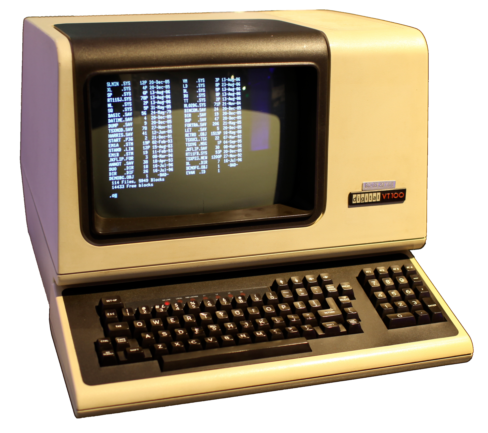

### Command Line vs GUI
#### What's a CLI?
- You might heard about it like "command prompt", command line", "CLI", "terminal" (Same concept but may be difference in technical).
- In short, CLI is a text-based program that allows you to interact with computer.
#### What's a GUI?
- A user interface that allows users to interact with computers in a graphical ways (visuals images, icons,...)

GUI is easier to uses, you just simply "click" or "drag". But GUI some major drawbacks:
- Limited control over your apps
- Slower to operates
### Terminal
Just like CLI, terminal is refers to a programs that uses text-based to operate. Originally, the word "terminal" meant a physical devices that you type command into. 

But terminal not execute the command you type into but the shell is the one handle that.
#### Popular Terminal
- **GNOME Terminal**
- **Konsole**
- **Kitty**
- **Alacritty**

### Core file and Directory commands
#### Moving Around filesystem
- `pwd`:  Print current working directory
- `cd`: Change working directory
	- `cd ..`: Move down by one directory (you can do multiple `../`)
	- `cd name`: Move into child directory
	- `cd ~`: Return to home directory
#### Inspect Files and Folders
- `ls`: list files in current folder
	- `ls -a`: list all files, include hidden one
	- `ls -l`: Show permissions, owners, size and timestamps
- `stat file`: Show detailed metadata for a file or directory
#### Copy, Move, and Delete
- `cp file destination`: Copy file
- `cp -r source destination`: Copy directories recursively
- `mv file1.txt file2.txt`: Rename a file
- `mv /path/to/file /new/path`: Move a file or directory
- `rm -rf path`: Recursively and forcefully delete files or directories
#### Find things quickly
 - `find /path -name "filename"`: Search for a file by name
 - `find /path -type d -name "filename"`: Search for directories by name
 - `grep`: Print lines that match patterns
	 - `grep -rl "patterns" /path`: Print file that contain the pattern
#### Create dir and file
- `mkdir name`: Create a folder
- `touch name`: Create a file
#### View files content
- `cat filename`: Fully view file content